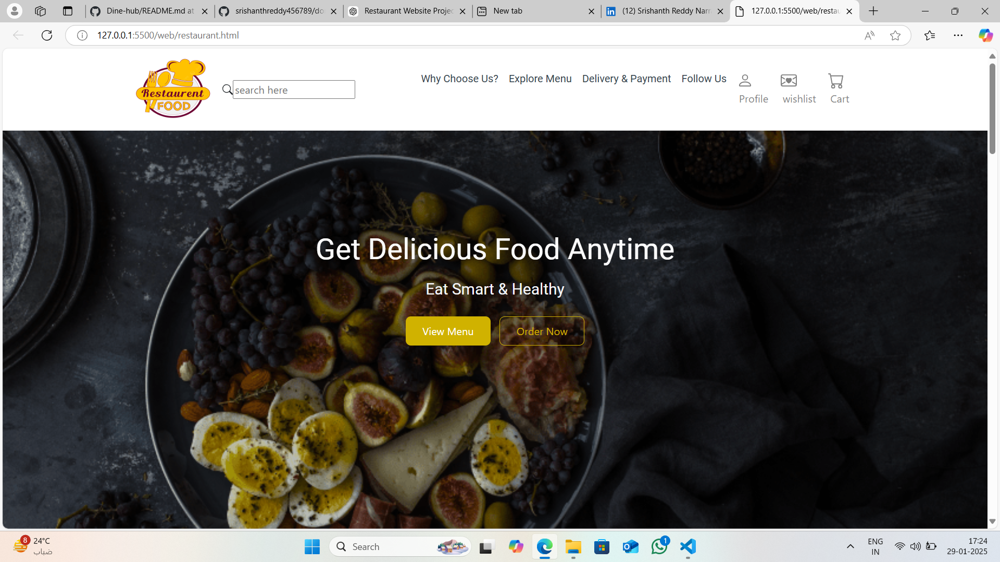
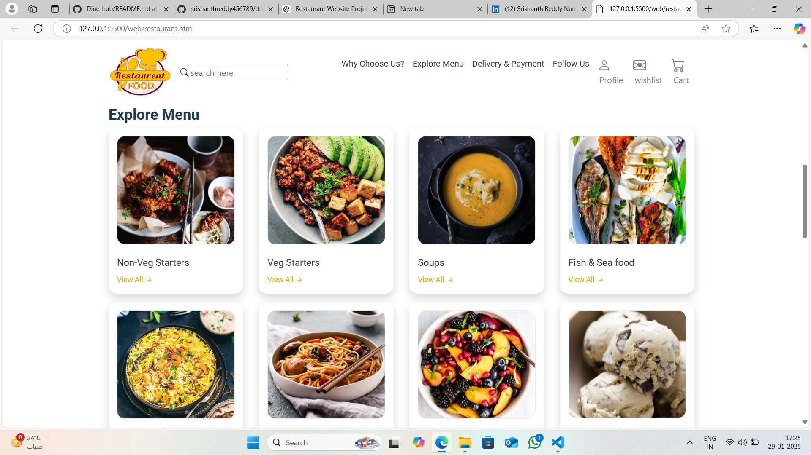

# 🍽️ Restaurant Website

A **fully responsive** restaurant website built using **HTML, CSS, JavaScript, and Bootstrap**. The website provides an elegant and user-friendly interface to showcase restaurant services, menu, and contact details.
## LINK:-(https://suraj-singh91.github.io/Dine-hub/)

## 📸 Screenshots

Home page:

Menu page:

About,Delivery and Payment:

Gift card and Follow us:

## 🚀 Features

- **Responsive Design** – Works seamlessly on all screen sizes.
- **Interactive UI** – Engaging animations and smooth scrolling.
- **Menu Showcase** – Displays restaurant menu items beautifully.
- **Contact Form** – Allows users to reach out easily.
- **Bootstrap Integration** – Ensures fast and flexible styling.
- **Optimized Performance** – Fast loading with clean code.

## 🛠️ Technologies Used

- **HTML5** – Structure of the website
- **CSS3** – Styling and responsiveness
- **JavaScript** – Interactivity and dynamic behavior
- **Bootstrap** – Grid system and pre-styled components

## 📜 License
This project is licensed under the MIT License. See the LICENSE file for details

## ✨ Author
👤 [Suraj Kumar Singh] 
📧 Email: ssuraj4156@gmail.com 
🔗 Mobile no: +91-9199446515 
📌 LinkedIn: [linkedin.com/in/yourprofile](https://www.linkedin.com/in/suraj-singh-0b7676360/)

